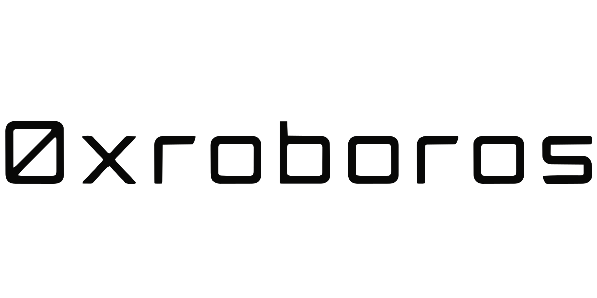

<picture>
<source media="(prefers-color-scheme: dark)" srcset="../assets/brand/0xroboros-wordmark_white_transparent.svg">

</picture> <strong>Browser</strong>

# Docs

This is a community fork of [lightpanda-io/browser](https://github.com/lightpanda-io/browser)
(AGPL-3.0-only) adding native Handshake (HNS) name resolution and DANE/TLSA
authentication, with an agent-facing trust surface over MCP and CDP. Not
affiliated with, endorsed by, or published by Lightpanda / Selecy SAS —
every diff against upstream is enumerated in [`../MODIFICATIONS.md`](../MODIFICATIONS.md).

- **[install.md](install.md)** — OCI image, platform binaries, building
  from source, verifying what you're running.
- **[quickstart.md](quickstart.md)** — one HNS fetch, one agent verdict
  call, against a real public Handshake name.
- **[resolvers.md](resolvers.md)** — the SPV vs DoH lanes, the full DoH
  endpoint list and fallback order, and the TRUSTED-vs-verified vocabulary
  this fork uses throughout.
- **[hns-agent-verdicts.md](hns-agent-verdicts.md)** — the `hns-verdict/1`
  schema agents get back from the MCP `verdict` tool and the CDP
  `LP.getHnsVerdict` command: full field reference and a worked example.
- **[UPSTREAM-SYNC.md](UPSTREAM-SYNC.md)** — how this fork keeps tracking
  upstream: the pull-only policy, the merge-and-verify procedure, and the
  sync cadence.
- **[LICENSE-POSTURE.md](LICENSE-POSTURE.md)** — the architectural boundary
  between this AGPL-3.0 codebase and 0xroboros's own proprietary work
  (internal position record, not legal advice).

For everything else — the full CLI surface (`serve`/`fetch`/`mcp`/`agent`/
`run`), development setup, testing — see [`../README.md`](../README.md)
and [`../CONTRIBUTING.md`](../CONTRIBUTING.md), which this fork inherits
from upstream unchanged except where MODIFICATIONS.md says otherwise.
